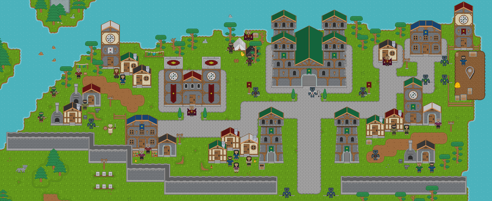
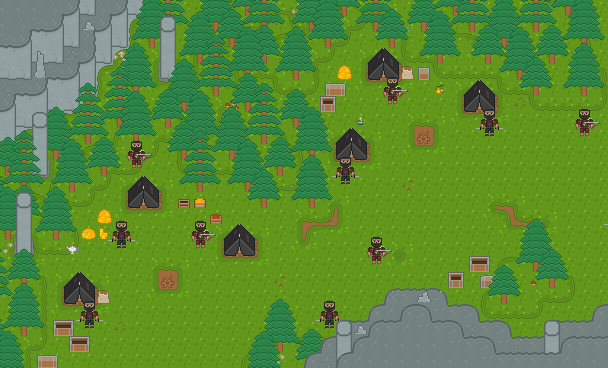
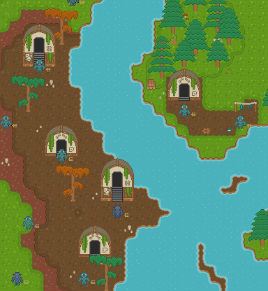
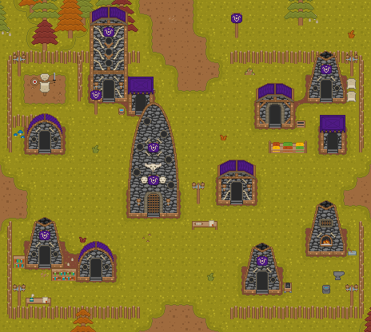
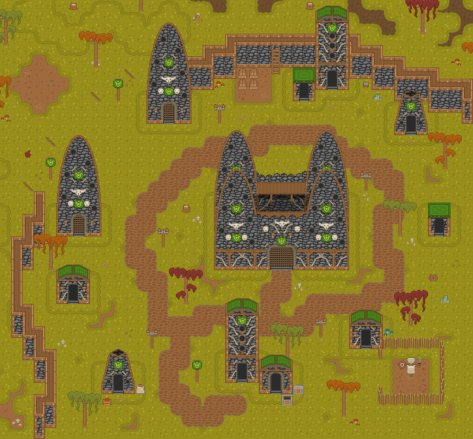

# Tides of War

#### Author:
Ruben Alvarez Reyes

rubenar1996@gmail.com

#### Description:
A pixel art role-playing-game (RPG) for Android.

#### Features:
* 200+ items
* 80+ characters
* 50+ quests
* 30+ spells
* 5+ maps

#### Programs used:
* [**Godot Game Engine**](https://godotengine.org/)
* [**Tiled Map Editor**](https://www.mapeditor.org/)
* [**ToW-tools**](https://github.com/thisisnotruben/ToW-tools)
* [**Aseprite**](https://www.aseprite.org/)
* [**GIMP**](https://www.gimp.org/)

#### Screenshots:

