# Tides of War

## Author
Ruben Alvarez Reyes

Email: rubenar1996@gmail.com

Twitter: [thisisnotruben_](https://twitter.com/thisisnotruben_)

Instagram: [thisisnotruben](https://www.instagram.com/thisisnotruben/)

Facebook: [Ruben Alvarez Reyes](https://www.facebook.com/thisisnotruben)

## Description:
A currently in development pixel art role-playing-game (RPG) for Android.

## Features:
* 200+ items
* 200+ characters
* 50+ quests
* 30+ spells
* 5+ maps

## Programs used:
* [Godot Game Engine](https://godotengine.org/)
* [Tiled Map Editor](https://www.mapeditor.org/)
* [ToW-tools](https://github.com/thisisnotruben/ToW-tools)
* [Aseprite](https://www.aseprite.org/)
* [GIMP](https://www.gimp.org/)

## Screenshots:

### Zone 1
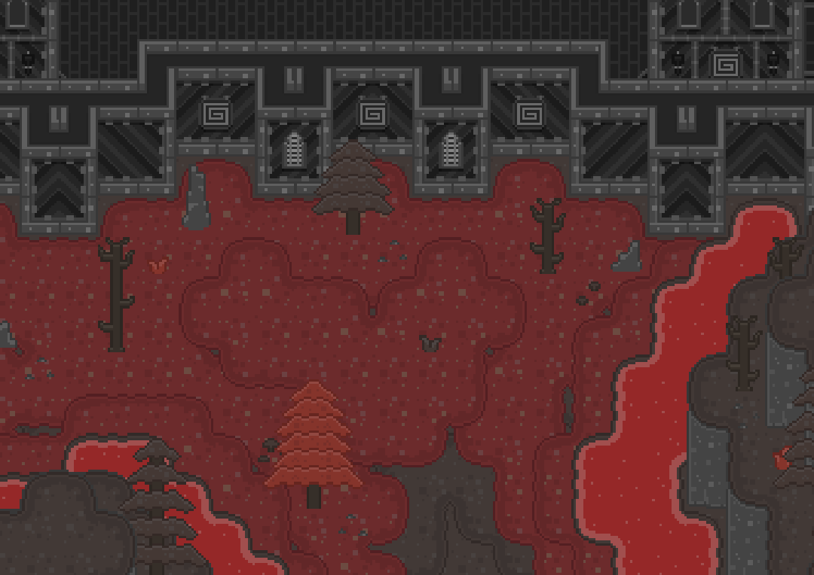
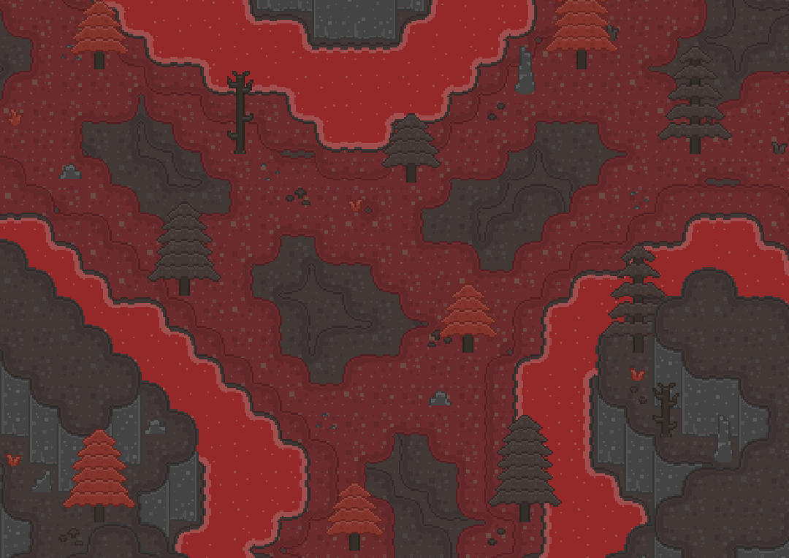
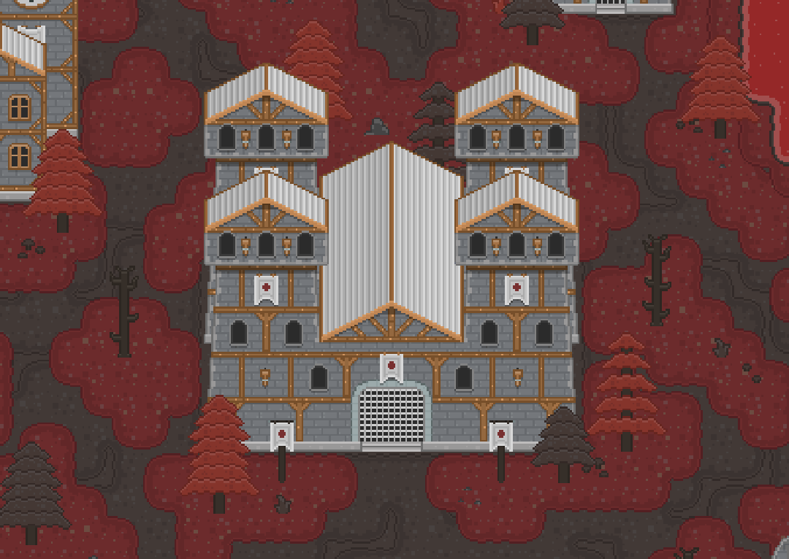

### Zone 2
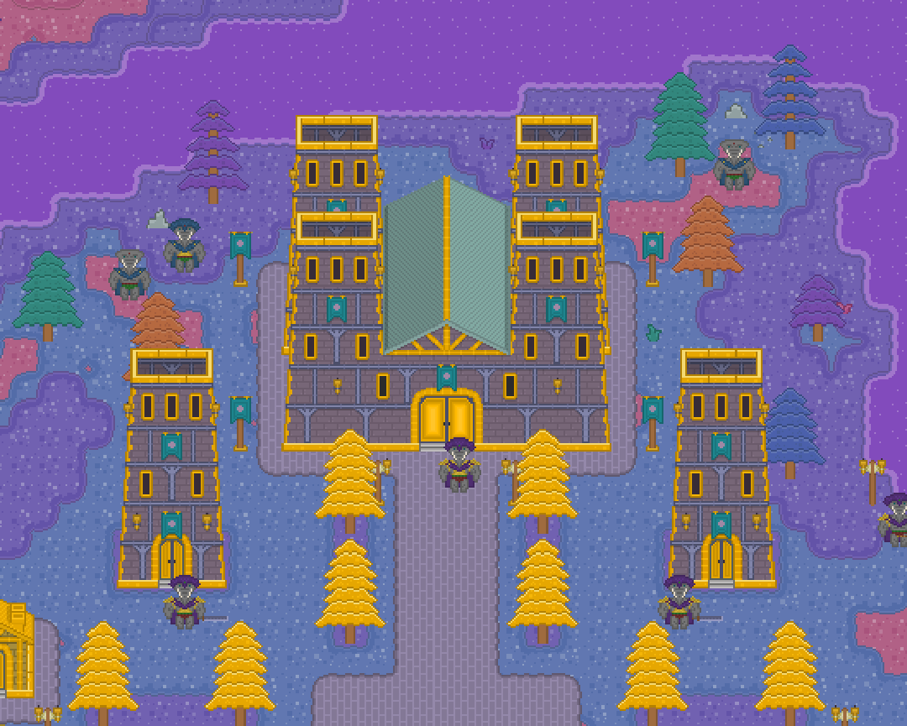
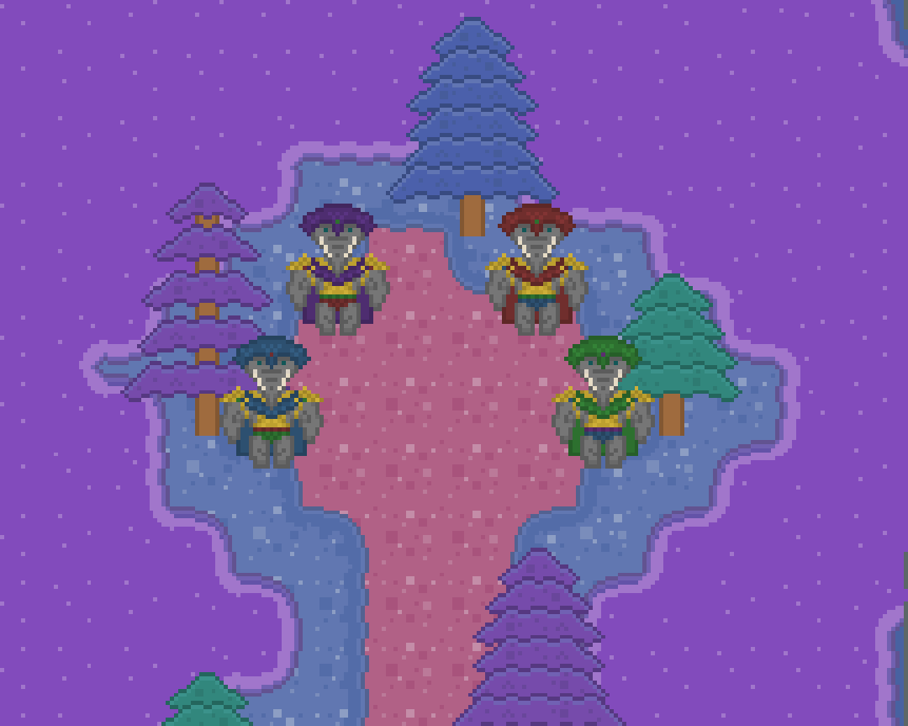
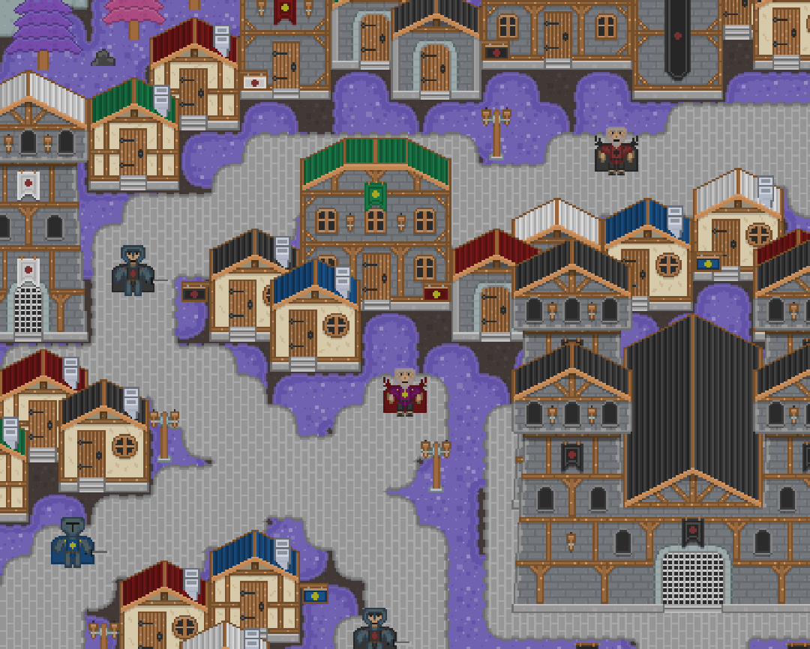

### Zone 3
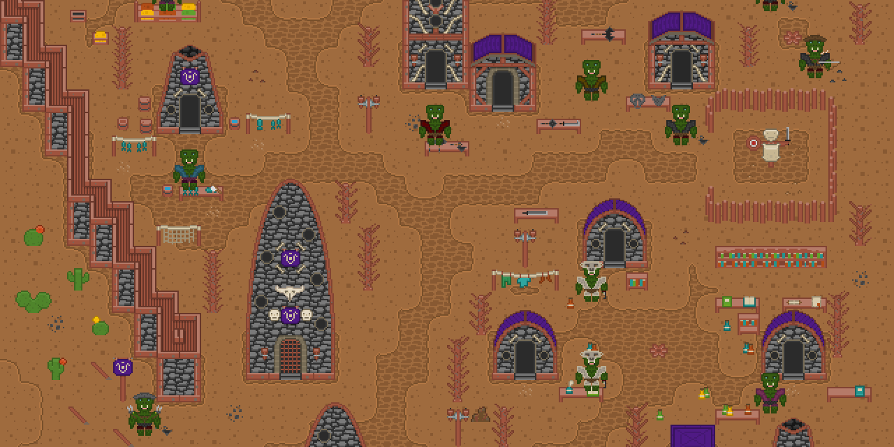

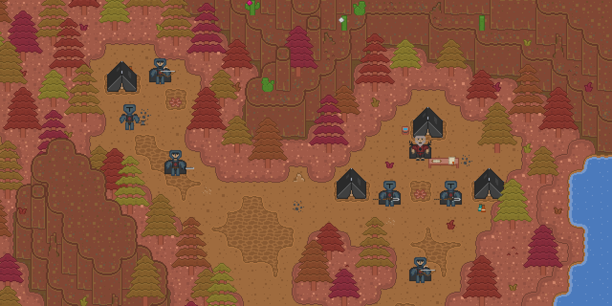

### Zone 4

### Zone 5
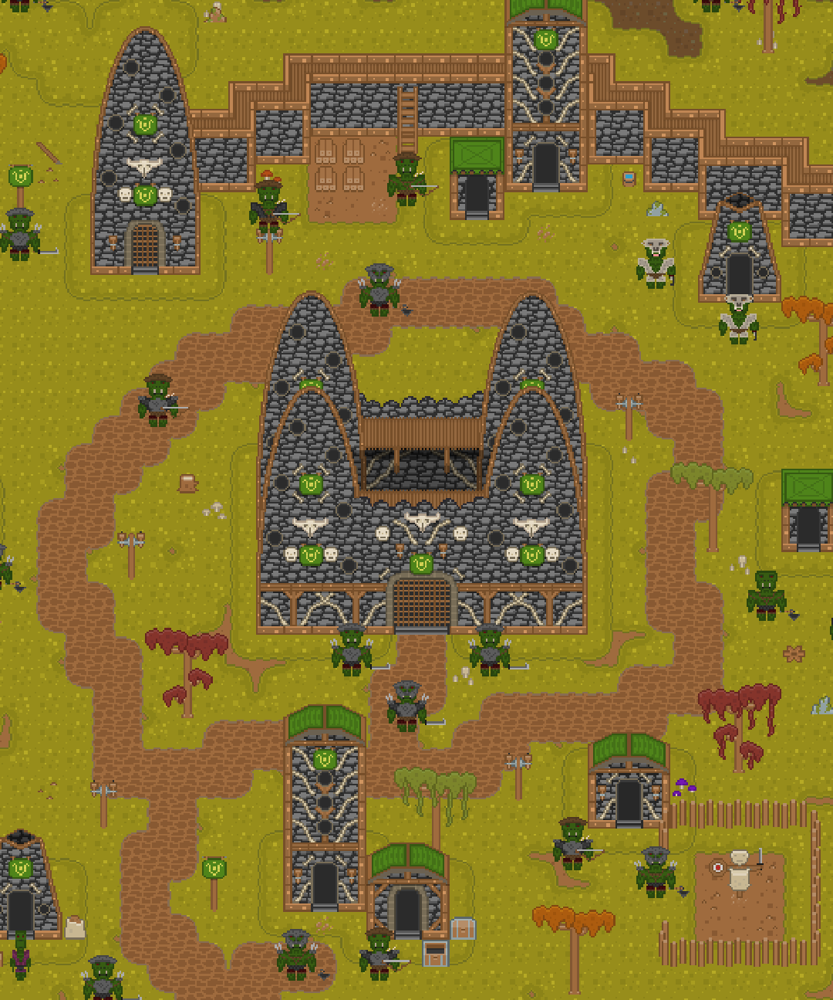
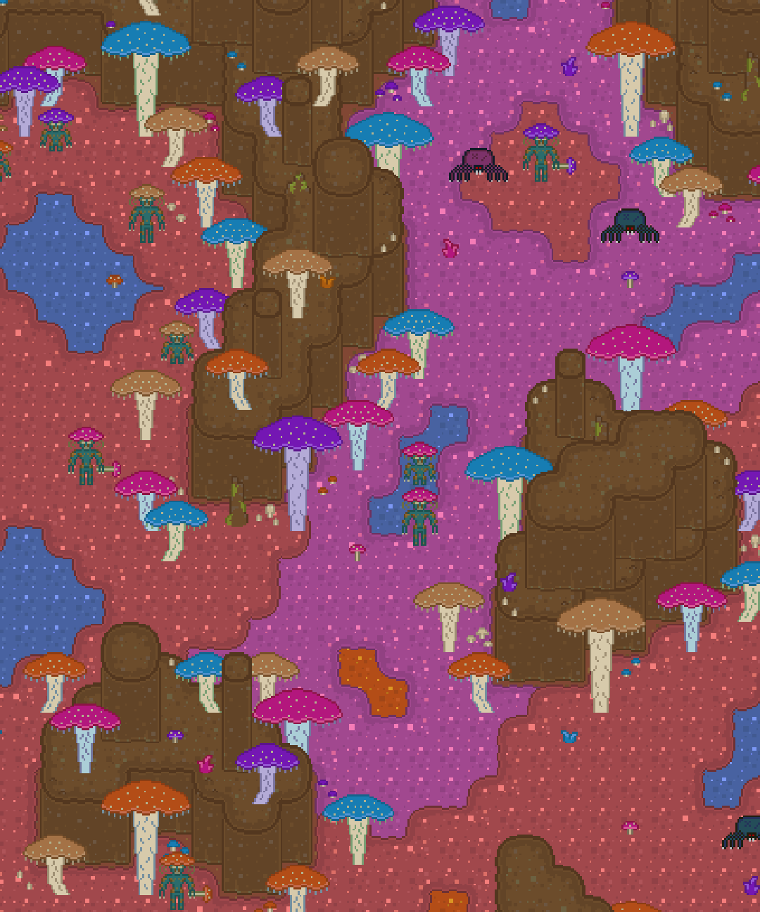
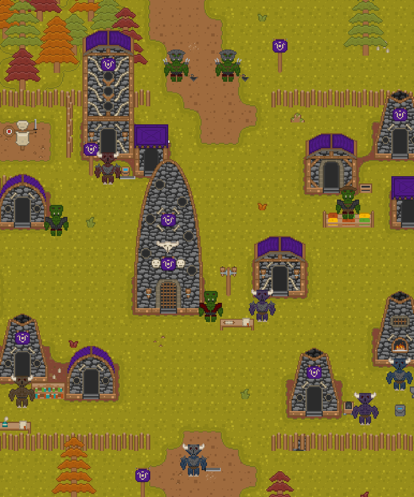
